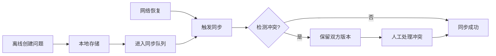

## 1. 产品概述

本地优先的巡店问题采集 PWA，支持门店巡检的全流程离线工作。解决连锁门店巡检中网络不稳定、数据不同步的痛点，实现问题从发现到闭环的完整追踪。

- **核心价值**：离线可用、数据可靠、状态可追溯、多角色协同
- **目标用户**：巡检员、店长、督导三类角色
- **市场价值**：提升巡店效率，确保问题闭环，降低管理成本

## 2. 核心功能

### 2.1 用户角色

| 角色 | 登录方式 | 核心权限 |
|------|---------|----------|
| 巡检员 | 身份选择 | 创建问题草稿、提交问题、查看自己创建的问题 |
| 店长 | 身份选择 | 查看门店问题、关闭已解决问题、导出问题记录 |
| 督导 | 身份选择 | 驳回问题、查看所有门店问题、导入模板和门店清单 |

### 2.2 功能模块

1. **身份选择页**：角色切换、当前身份显示
2. **问题列表页**：问题筛选、状态查看、离线/在线状态
3. **问题创建/编辑页**：草稿保存、图片上传（本地模拟）、模板字段填充
4. **同步队列页**：待同步项列表、同步状态、手动触发同步
5. **配置导入页**：门店清单导入、检查模板导入
6. **操作历史页**：状态变更记录、版本冲突记录
7. **导出功能**：本地导出问题记录为 JSON/CSV

### 2.3 页面详情

| 页面名称 | 模块名称 | 功能描述 |
|---------|---------|----------|
| 身份选择 | 角色卡片 | 点击切换角色，显示当前权限说明 |
| 问题列表 | 筛选区 | 按状态、门店、创建人筛选问题 |
| 问题列表 | 问题卡片 | 显示问题标题、状态、门店、优先级，点击查看详情 |
| 问题详情 | 状态流转 | 草稿→提交→驳回/关闭的状态按钮 |
| 问题详情 | 版本冲突 | 显示冲突双方内容，提供选择操作 |
| 创建问题 | 模板表单 | 动态字段渲染，必填项校验 |
| 同步队列 | 列表区 | 显示待同步、同步中、同步失败项 |
| 同步队列 | 操作区 | 手动同步、全部同步、清空失败项 |
| 配置导入 | 导入区 | JSON 文件导入门店和模板 |
| 操作历史 | 时间线 | 状态变更时间线，冲突记录高亮 |
| 顶部状态栏 | 状态指示器 | 离线/在线切换、待同步数量徽章 |

## 3. 核心流程

### 主流程描述
1. 督导导入门店清单和检查模板
2. 巡检员离线创建问题，自动保存为草稿
3. 巡检员提交问题，进入同步队列
4. 网络恢复后自动/手动同步到服务器
5. 店长查看问题，核实后关闭问题
6. 督导可驳回需要补充信息的问题
7. 导出问题记录用于汇报

### 状态流转图
```mermaid
stateDiagram-v2
    [*] --> 草稿: 创建问题
    草稿 --> 已提交: 提交
    草稿 --> 草稿: 保存修改
    已提交 --> 已驳回: 督导驳回
    已驳回 --> 已提交: 修改后重提
    已提交 --> 已关闭: 店长关闭
    已关闭 --> 已提交: 重新打开
    已提交 --> 同步队列: 待同步
    同步队列 --> 已提交: 同步成功
    同步队列 --> 冲突: 版本冲突
    冲突 --> 已提交: 冲突解决
```

### 同步流程图


## 4. 用户界面设计

### 4.1 设计风格
- **设计方向**：工业/实用主义风格，强调功能性和可靠性
- **主色调**：深蓝色 `#1e3a5f`（专业、可靠）
- **辅助色**：橙色 `#f59e0b`（警告、待处理）、绿色 `#10b981`（成功、已关闭）、红色 `#ef4444`（错误、冲突）
- **中性色**：深灰 `#1f2937`、中灰 `#6b7280`、浅灰 `#f3f4f6`
- **字体**：系统无衬线字体，强调可读性
- **按钮风格**：直角矩形，2px 边框，hover 状态背景加深
- **布局**：卡片式布局，清晰的视觉层次
- **图标**：lucide-react 线性图标，保持统一风格

### 4.2 页面设计概览

| 页面名称 | 模块名称 | UI 元素 |
|---------|---------|----------|
| 身份选择 | 角色卡片 | 三张卡片并排，选中状态有蓝色边框和勾选标记 |
| 问题列表 | 顶部栏 | 在线/离线切换按钮（带指示灯）、待同步数量徽章 |
| 问题列表 | 筛选标签 | 水平滚动的状态标签，选中高亮 |
| 问题列表 | 问题卡片 | 左侧状态色条，标题、门店、时间、优先级标签 |
| 问题详情 | 信息区 | 网格布局的字段信息，图片缩略图 |
| 问题详情 | 状态操作区 | 底部固定操作栏，根据角色显示可用操作 |
| 问题详情 | 冲突提示 | 红色背景的冲突卡片，左右对比布局 |
| 创建问题 | 表单区 | 分组字段，必填项红色星号，底部保存/提交按钮 |
| 同步队列 | 列表项 | 左侧同步状态图标，右侧问题标题和重试按钮 |
| 配置导入 | 导入区域 | 拖放区域，文件选择按钮，导入结果预览 |
| 操作历史 | 时间线 | 垂直线连接的事件卡片，冲突项红色边框 |

### 4.3 响应式
- **桌面优先**：PC 端三栏布局（侧边导航 + 主内容 + 详情面板）
- **平板适配**：两栏布局（侧边导航收起为图标 + 主内容）
- **手机适配**：单栏布局，底部 tab 导航，全屏详情页
- **触摸优化**：按钮最小 44x44px，列表项足够间距，滑动操作

### 4.4 微交互设计
- **状态指示灯**：在线时绿色呼吸动画，离线时红色常亮
- **同步动画**：同步中图标旋转，成功时对勾缩放动画
- **表单错误**：缺少必填项时字段红色抖动动画
- **冲突提示**：出现冲突时红色闪烁边框
- **页面切换**：左右滑动过渡动画
- **加载状态**：骨架屏脉冲动画
