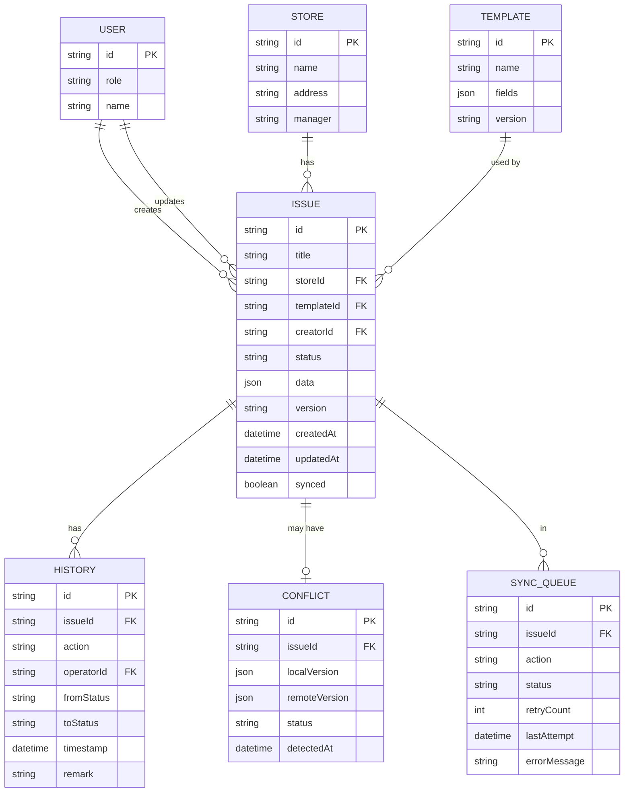

## 1. 架构设计


## 2. 技术描述

- **前端框架**：React@18 + TypeScript
- **构建工具**：Vite@5
- **样式方案**：TailwindCSS@3
- **状态管理**：Zustand
- **路由**：React Router DOM@6
- **图标**：Lucide React
- **本地数据库**：IndexedDB (idb 库封装)
- **PWA 支持**：Vite PWA 插件
- **后端模拟**：内存模拟服务，无需真实后端

## 3. 数据模型

### 3.1 ER 图



### 3.2 核心数据结构定义

```typescript
type UserRole = 'inspector' | 'manager' | 'supervisor';

interface User {
  id: string;
  role: UserRole;
  name: string;
}

interface Store {
  id: string;
  name: string;
  address: string;
  manager: string;
}

interface TemplateField {
  key: string;
  label: string;
  type: 'text' | 'textarea' | 'select' | 'image' | 'number';
  required: boolean;
  options?: string[];
}

interface Template {
  id: string;
  name: string;
  fields: TemplateField[];
  version: string;
  createdAt: string;
}

type IssueStatus = 'draft' | 'submitted' | 'rejected' | 'closed';

interface Issue {
  id: string;
  title: string;
  storeId: string;
  templateId: string;
  creatorId: string;
  status: IssueStatus;
  data: Record<string, any>;
  version: number;
  createdAt: string;
  updatedAt: string;
  synced: boolean;
  images?: string[];
  priority?: 'low' | 'medium' | 'high';
}

interface History {
  id: string;
  issueId: string;
  action: 'create' | 'update' | 'submit' | 'reject' | 'close' | 'reopen';
  operatorId: string;
  operatorRole: UserRole;
  fromStatus?: IssueStatus;
  toStatus?: IssueStatus;
  timestamp: string;
  remark?: string;
}

interface Conflict {
  id: string;
  issueId: string;
  localVersion: Issue;
  remoteVersion: Issue;
  status: 'pending' | 'resolved';
  detectedAt: string;
  resolution?: 'local' | 'remote' | 'merge';
}

interface SyncQueueItem {
  id: string;
  issueId: string;
  action: 'create' | 'update' | 'delete';
  status: 'pending' | 'syncing' | 'failed' | 'completed';
  retryCount: number;
  lastAttempt?: string;
  errorMessage?: string;
  payload: Issue;
}
```

## 4. 路由定义

| 路由路径 | 页面 | 权限 |
|---------|------|------|
| `/` | 身份选择页 | 公开 |
| `/issues` | 问题列表页 | 所有角色 |
| `/issues/new` | 创建问题页 | 巡检员 |
| `/issues/:id` | 问题详情页 | 所有角色 |
| `/sync` | 同步队列页 | 所有角色 |
| `/history` | 操作历史页 | 所有角色 |
| `/config` | 配置导入页 | 督导 |
| `/export` | 导出页 | 店长、督导 |

## 5. 状态管理

### 5.1 Zustand Store 结构

```typescript
interface AppState {
  currentUser: User | null;
  isOnline: boolean;
  stores: Store[];
  templates: Template[];
  issues: Issue[];
  syncQueue: SyncQueueItem[];
  conflicts: Conflict[];
  histories: History[];
  
  setCurrentUser: (user: User | null) => void;
  setOnline: (online: boolean) => void;
  addStore: (store: Store) => void;
  addTemplate: (template: Template) => void;
  createIssue: (issue: Issue) => void;
  updateIssue: (id: string, updates: Partial<Issue>) => void;
  updateIssueStatus: (id: string, status: IssueStatus, operatorId: string) => void;
  addToSyncQueue: (item: SyncQueueItem) => void;
  processSyncQueue: () => Promise<void>;
  resolveConflict: (conflictId: string, resolution: 'local' | 'remote' | 'merge') => void;
  exportData: () => string;
  importStores: (stores: Store[]) => void;
  importTemplates: (templates: Template[]) => void;
}
```

### 5.2 权限控制

```typescript
const PERMISSIONS: Record<UserRole, string[]> = {
  inspector: ['issue:create', 'issue:edit_own', 'issue:view_own', 'sync:view'],
  manager: ['issue:view_all', 'issue:close', 'export:data', 'sync:view'],
  supervisor: ['issue:view_all', 'issue:reject', 'config:import', 'export:data', 'sync:manage', 'conflict:resolve']
};
```

## 6. 同步机制

### 6.1 同步流程

1. **离线操作**：所有写入先写入 IndexedDB，标记 `synced: false`
2. **队列管理**：变更操作自动加入同步队列
3. **网络监听**：`navigator.onLine` 事件触发自动同步
4. **手动同步**：用户可点击同步按钮触发
5. **冲突检测**：基于版本号比较，版本号不一致则创建冲突记录
6. **冲突保留**：双方版本完整保留，等待人工处理
7. **重试机制**：失败项指数退避重试，最多 3 次

### 6.2 模拟后端同步

```typescript
// 模拟服务器存储
const mockServerDB: Record<string, Issue> = {};

async function syncToServer(issue: Issue): Promise<{ success: boolean; conflict?: boolean; remoteVersion?: Issue }> {
  const existing = mockServerDB[issue.id];
  
  if (existing && existing.version > issue.version) {
    return { success: false, conflict: true, remoteVersion: existing };
  }
  
  mockServerDB[issue.id] = { ...issue, version: issue.version + 1 };
  return { success: true };
}
```

## 7. PWA 配置

### 7.1 Manifest 配置

```json
{
  "name": "巡店问题采集",
  "short_name": "巡店助手",
  "start_url": "/",
  "display": "standalone",
  "background_color": "#1e3a5f",
  "theme_color": "#1e3a5f",
  "icons": [
    { "src": "/icons/icon-192.png", "sizes": "192x192", "type": "image/png" },
    { "src": "/icons/icon-512.png", "sizes": "512x512", "type": "image/png" }
  ]
}
```

### 7.2 Service Worker 策略

- **静态资源**：Cache First 策略
- **API 请求**：Network First，失败回退到本地缓存
- **后台同步**：使用 Background Sync API 在网络恢复时自动同步

## 8. 错误处理

| 错误类型 | 检测时机 | 提示方式 | 操作按钮 |
|---------|---------|---------|---------|
| 缺少必填项 | 提交表单时 | 红色边框 + 错误文字 | 返回修改 |
| 无权关闭 | 点击关闭按钮时 | Toast 提示 | 确定 |
| 重复问题编号 | 创建问题时 | 表单内联提示 | 重新生成编号 |
| 版本冲突 | 同步时 | 冲突对比卡片 | 选择本地/远程/合并 |
| 同步失败 | 同步队列 | 红色状态标记 | 重试 / 查看错误 |
